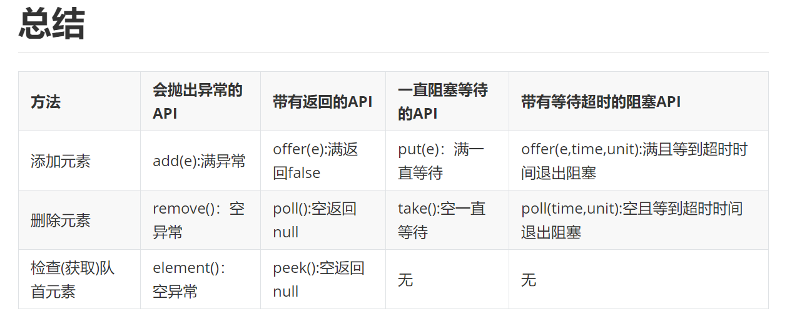

- [java](#java)
  - [线程](#线程)
    - [线程，进程和协程](#线程进程和协程)
  - [锁](#锁)
    - [锁你知道哪些](#锁你知道哪些)
    - [atomic](#atomic)
    - [用过哪些锁，加解锁原理？](#用过哪些锁加解锁原理)
      - [ReentrantLock，ReentrantReadWriteLock](#reentrantlockreentrantreadwritelock)
      - [CountDownLatch，CyclicBarrier，Semaphore](#countdownlatchcyclicbarriersemaphore)
  - [ThreadPool](#threadpool)
    - [为什么用线程池](#为什么用线程池)
    - [线程池的参数](#线程池的参数)
    - [线程池的执行流程](#线程池的执行流程)
  - [threadLocal](#threadlocal)
    - [ThreadLocal 特性和原理](#threadlocal-特性和原理)
    - [ThreadLocal 内存泄露和使用](#threadlocal-内存泄露和使用)
  - [List](#list)
    - [Collections.sort 和 Arrays.sort 的实现原理](#collectionssort-和-arrayssort-的实现原理)
    - [Iterator 作用，集合快速失败和失败安全](#iterator-作用集合快速失败和失败安全)
    - [ArrayList](#arraylist)
    - [Vector](#vector)
    - [LinkedList](#linkedlist)
    - [CopyOnWriteArrayList](#copyonwritearraylist)
  - [Map](#map)
    - [HashMap](#hashmap)
    - [ConcurrentHashMap](#concurrenthashmap)
  - [Queue](#queue)
    - [PriorityQueue](#priorityqueue)
    - [LinkedList](#linkedlist-1)
    - [LinkedBlockingQueue](#linkedblockingqueue)
    - [ArrayBlockingQueue](#arrayblockingqueue)
    - [DelayQueue](#delayqueue)
## java

### 线程
#### 线程，进程和协程
1. 进程与线程的区别
进程是CPU资源分配的基本单位，线程是独立运行和独立调度的基本单位（CPU上真正运行的是线程）。
进程拥有自己的资源空间，一个进程包含若干个线程，线程与CPU资源分配无关，多个线程共享同一进程内的资源。
线程的调度与切换比进程快很多。
2. 协程
协程拥有自己的寄存器上下文和栈。协程调度切换时，将寄存器上下文和栈保存到其他地方，在切回来的时候，恢复先前保存的寄存器上下文和栈。因此：
协程能保留上一次调用时的状态（即所有局部状态的一个特定组合），每次过程重入时，就相当于进入上一次调用的状态，换种说法：进入上一次离开时所处逻辑流的位置。

协程的好处：

无需线程上下文切换的开销
无需原子操作锁定及同步的开销
方便切换控制流，简化编程模型
高并发+高扩展性+低成本：一个CPU支持上万的协程都不是问题。所以很适合用于高并发处理。

### 锁
#### 锁你知道哪些

1. cas + volatile
```
volatile保证可见性和有序性，但是不保证原子性。
可见性：其实现原理是在汇编层面加Lock，当对volatile修饰的变量进行修改时，会将数据直接写回内存，同时让其他线程的工作内存失效，后续读取该变量时直接读内存最新数据；
有序性：当在使用该变量的前后需要保证其语义的顺序性：通过过在指令间插入一条内存屏障并禁止cpu对Volatile修饰的变量进行重排序
```
2. [synchronized](https://xiaomi-info.github.io/2020/03/24/synchronized/) 
偏向锁，轻量级锁，重量级锁，自旋性
```
实现原理使用对象监视器锁，当加锁的时候，首先是判断是否已经加锁，没有则进行加锁，加锁失败，则将线程放入阻塞对立，当释放锁的时候唤醒阻塞队列
利用的是对象头（对象头+数据+对齐）
对象头： mark word + KClass+ arrayLength
mark word： 存储了偏向线程，hashcode,GC年代，锁的状态，是否加锁，偏向性，轻量性，重量型状态
```
3. [AQS](https://tech.meituan.com/2018/11/15/java-lock.html) 
   公平性，独占锁，共享锁，重入性，自旋性（自适应）,读写锁，邮戳锁(版本号) 
```
AQS 通过volatile state 保证锁的状态，通过队列存储阻塞的线程，通过唤醒队列中线程进行执行，并支持了可中断性；
对于独占锁，状态只有0和N，以可重入公平锁为例；
加锁时，如果锁状态为0，则判断阻塞队列是否为空，如果不为空，则阻塞线程，直接进入队列，
保证了公平性；如果队列为空，cas修改状态为1，如果成功，则加锁成功，则设备锁线程为当前线程，执行任务，如果加锁失败，则加入阻塞队列；如果状态不为0，
则判断锁线程是否为当前线程，如果是，则加锁成功，state+1,执行任务;如果不是当前线程，则阻塞线程放入阻塞队列；
解锁时，首先是将状态减一，如果状态值为0，则查看阻塞队列，如果队列为空，则释放完成，如果不为空，唤醒对立头获取锁，执行任务。

对于共享锁：状态为n和0，以countdown latch为例
首先创建锁，设置为N,表示可以有N个线程共享状态，当某个线程调用api到达状态时，将状态减一，并将线程阻塞放入队列中；然后判断状态是否为0，如果是，则唤醒所有的阻塞线程同时执行。
```
#### atomic
原子操作类，主要通过volatile+cas保证数据的可见性和原子性
#### 用过哪些锁，加解锁原理？
##### ReentrantLock，ReentrantReadWriteLock
可重入性，公平性，自旋性
读写分离锁，
##### CountDownLatch，CyclicBarrier，Semaphore
前两个是瞬时并发，第一个只能用一次，后一个可以重复只用
信号量是持续并发，通过令牌设置最大的并发数
### ThreadPool
[线程池](https://mp.weixin.qq.com/s/axWymUaYaARtvsYqvfyTtw)
[问题](https://mp.weixin.qq.com/s/fGqAM0Or0dlQtrEYg2xNMA)
#### 为什么用线程池
```
线程的创建，销毁和多线程间切换是比较耗时的动作，池化思想就是重复的利用线程资源，减少对线程的创建，销毁和切换动作，提高线程的使用率。
```
#### 线程池的参数
```
int corePoolSize,
int maximumPoolSize,
long keepAliveTime,
TimeUnit unit,
BlockingQueue<Runnable> workQueue,  // 阻塞队列，在内部线程获取队列任务时，需要阻塞特性，队列需要考虑内存资源的消耗
ThreadFactory threadFactory,  // 线程池创建线程工厂
RejectedExecutionHandler handler // 当线程关闭或者线程任务队列满时需要使用策略，（丢弃抛异常，调用线程执行，丢弃新任务，丢弃老任务
```
#### 线程池的执行流程
```
submit(task):
首先将task包装为一个FutureTask
执行execute(futureTask)
返回future

execute(task):
首先时判断运行线程数是否超过核心线程数
没有，则创建worker线程执行任务
超过，判断线程状态，并将任务加入任务队列，
成功加入，做二次判断线程状态，并判断当前线程数是否为0，为0则创建线程执行任务，
加入失败，则添加worker,
addWorker():
添加worker会计数当前运行线程数，并比较最大线程数，超过则拒绝任务
没有超过，启动线程执行任务

run():
线程运行循环获取任务
首先是执行firstTask,
然后getTask():
首先池状态为shutdown或者stop和队列是否为空，满足则减少线程数，退出线程
否则判断线程数大于核心线程数并且队列为空，满足则减少线程，退出线程
否则根据allowCoreThreadTimeOut || wc > corePoolSize，是否进行超时获取和阻塞获取
获取任务后进行执行任务
任务执行具有before ,after 扩展
```
### [threadLocal](https://zhuanlan.zhihu.com/p/402281916) 
#### ThreadLocal 特性和原理
```
ThreadLocal 可以实现线程集变量隔离，可以解决并发下线程对同一个初始变量的操作。

原理： 利用了Thread 的内部属性ThreadLocalMap,存储了当前线程的ThreadLocal 变量的映射关系，其Entry 中的key是弱引用的ThreadLocal, 但是value是强应用的对象。

数据结构为ThreadLocalMap，其内部Entry key值为WeakReference<ThreadLocal<?>>,当key不被使用后，会被回收
默认容量为16，阈值为2/3,扩容一倍

```
#### ThreadLocal 内存泄露和使用
1. get流程
```

```
2. set 流程
```

```
3. 内存泄漏
```

```

### List

#### Collections.sort 和 Arrays.sort 的实现原理
```
Collection.sort 是对 list 进行排序，Arrays.sort 是对数组进行排序
Collections.sort 方法底层就是调用的 Array.sort 方法
Arrays 的 sort 方法底层就是：
legacyMergeSort(a)，归并排序，
ComparableTimSort.sort()：即 Timsort 排序。
Timesort 排序
Timsort 排序是结合了合并排序（merge.sort）和插入排序（insertion sort）而得出的排序方法
```
#### Iterator 作用，集合快速失败和失败安全
迭代器主要用于安全的遍历集合，可以通过迭代器遍历安全的删除集合元素
当迭代器遍历过程中有其他线程对集合进行修改操作，会抛出ConcurrentModificationException，
java.util包下的集合类都是快速失败的，不能在多线程下发生并发修改

失败安全机制的集合容器，在遍历时不是直接在集合内容上访问的，而是先复制原有集合内容，在拷贝的集合上进行遍历。
java.util.concurrent包下的容器都是安全失败，可以在多线程下并发使用，并发修改。CopyOnWriteArrayList
#### ArrayList

``` 
1. 基于数组实现的非线程安全的容器
2. 创建时默认初始化容量时10，当能估算容量时可以指定容量初始化
3. 添加元素首先是判断是否需要扩容，扩容使用System.arraycopy方法进行复制，元素按照添加顺序追加到数组
4. 获取数据支持对象获取，遍历数组；支持index 获取，直接随机访问
5. 删除数据支持对象删除，遍历查询；支持index删除；最终都会使用System.arraycopy方法移动数组数据
6. private transient Object[] elementData;transient修饰符是什么含义？们创建了new Object[10]数组对象，
但是我们只向其中添加了1个元素，而剩余的9个位置并没有添加元素。全部序列化浪费存储空间
7. Arrays.copyOf()底层实现是调用System.arraycopy() 
arraycopy(Object src,  int  srcPos, Object dest, int destPos, int length);
8. 扩容：一次扩容一半空间
9. 插入的元素可以为null
```

#### Vector
``` 
1. Vector与ArrayList一样，也是通过数组实现的，不同的是它支持线程的同步，即某一时刻只有一个线程能够写Vector,线程安全，但是性能低
2. Vector是默认扩展1倍
```
#### LinkedList
``` 
LinkedList是用链表结构存储数据的，很适合数据的动态插入和删除，随机访问和遍历速度比较慢;
实现Deque，Deque 是一个双向队列，也就是既可以先入先出，又可以先入后出，可以当作堆栈、队列和双向队列使用。
```
#### CopyOnWriteArrayList
``` 
线程安全且读操作无锁的ArrayList，写操作则通过创建底层数组的新副本来实现，
是一种读写分离的并发策略，我们也可以称这种容器为"写时复制器"，Java并发包中类似的容器还有CopyOnWriteSet
实现原理：
final transient ReentrantLock lock = new ReentrantLock() : 利用锁实现对数组的修改操作（添加,更新和删除）
private transient volatile Object[] array : 使用volatile 修饰数组；当数组的引用改变时，对其他读线程都是立即可见的(线程内存失效,读主存)
在修改操作中；都是先copy 了一份原数组，然后修改；再将修改后的数组赋值给原数组，保证了数组级的可见性和元素级的修改。
存在的问题：
1. 内存消耗问题
2. 无法保证实时性；数据最终一致性问题；
3. 修改时使用了锁；并发性一般
特点：
1. 每次都是直接copy 的一个数组，所以不存在扩容问题，但是对内存的消耗很大
2. 线程安全，无锁读取
```

### Map
[hashmap 面试](http://mp.weixin.qq.com/s?__biz=Mzg3NzU5NTIwNg==&mid=2247497880&idx=1&sn=44f8c95075f507bad207182ec0d452f1&chksm=cf2227b1f855aea71a6bf6a2e996f45482256468021497e3811b6761d2d3f8bba53f54978257&scene=126&&sessionid=1645761094#rd)
#### HashMap
[hashmap](https://www.jianshu.com/p/f238874a8bb8)
1. HashMap 数据结构: JDK1.8的数据结构是数组+链表+红黑树。
2. 默认扩容因子0.75，默认容量大小16
3. hash 函数：(h = key.hashCode()) ^ (h >>> 16) :减少低16位相同导致的hash冲突
4. put 过程
``` 
1. 数据元素通过散列函数得到hash值，首先看table是否位空，为空则初始化table
2. 通过hash&(n-1)映射到桶数组对应索引的位置,判断桶位是否存在元素，不存在直接NewNode 放入table，进入步骤5
3. 如果存在元素，则遍历Node,查看是否存在value值一样的节点，如果存在新数据写入key值，直接return旧数据;
4. 不存在则加入链表，如果链表长度>8&数组大小>=64，链表转为红黑树，
5. 并size++,判断是否超过阈值，超过则进行扩容,return null
```
5. 扩容过程
```

```
6. 查找元素过程
```  
1. 使用扰动函数，获取新的哈希值,
2. 判断table是否为空，为空 return null;
3. 通过hash值计算数组下标，获取节点
4. 头节点和key匹配，直接返回
5. 否则，当前节点是否为树节点，查找红黑树，否则，遍历链表查找
6. 查找到与key值匹配，return 数据，否则return null;
``` 
7. 为什么HashMap的容量是2的倍数呢a
```
第一个原因是为了方便哈希取余利用&运算提高性能：
第二个原因是为了在扩容的时候能够将hash冲突的节点分散到table新容量中
```
6. 为什么用红黑树
``` 
红黑树是一个平衡树，增删改查时间负责的都是logN；
红黑树特点：
根节点和叶子节点都是黑色
红色节点的两个子节点一定是黑色
从任意节点到子树的两个子节点通过的黑色节点数一致

```
#### ConcurrentHashMap
[ConcurrentHashMap](https://mp.weixin.qq.com/s/ZmOLsoaFQDfLg6oMQPgBdg)

 JDK1.7 版本中，ConcurrentHashMap 由数组 + Segment + 分段锁实现，
 其内部氛围一个个段（Segment）数组，Segment` 通过继承ReentrantLock来进行加锁，
 通过每次锁住一个segment来降低锁的粒度而且保证了每个segment内的操作的线程安全性，从而实现全局线程安全.
 缺陷就是每次通过 hash 确认位置时需要 2 次才能定位到当前 key 应该落在哪个槽,
 相较与JDK1.8 锁的粒度还是很大

JDK1.8 中使用数据结构为 数据+链表+红黑树；大量使用cas和synchronized减小锁的粒度，通过位运算极致优化性能

1. get 流程
```
1. 首先判断key是否为空，为空抛出异常
2. 计算key的hash ,然后进行 h^(h>>>16)&0x7fffffff
3. table 为空，返回null
4. table 不为空，计算hash桶位，比较节点（比较hash值，比较key值），相同返回数据
5. 不相同，判断节点是否位树节点，不是则遍历链表，是则遍历树进行节点比较。返回数据

优化点： 
hash扰乱，减少hash碰撞
table 定位使用&位运算计算桶位优化
```
2. put 流程
```
1. 首先检测key,value是否为空，为空抛出空指针异常
2. 计算hash值，和get方法一致
3. for 循环 4-
4. table是否空，为空则需要进行 初始化，继续循环
5. table不为空，则计算hash桶位
6. 如果桶位为空，则cas替换当前桶位为该结点，失败，继续循环，成功退出
7. 不为空，判断几点是否被MOVED,如果正在迁移，帮助迁移，
8. 不为MOVED,则对节点加锁，加锁成功后判断当前桶位为节点是否相等，不等继续循环
9. 相等，则根据节点为树和链表进行遍历比较和add 操作，如果key存在，则返回旧值return
10. 如果新加key，则需要判断是否需要进行数据结构转换，判断添加为链表，树节点个数为8，6
11. 进行addCount操作
12. 判断是否超过阈值，进行扩容操作

```
3. table初始化
sizeCtl<-1 表示有 N-1 个线程正在执行扩容操作，如 -2 就表示有 2-1 个线程正在扩容。
sizeCtl=-1 占位符，表示当前正在初始化数组。
sizeCtl=0 默认状态，表示数组还没有被初始化。
sizeCtl>0 记录下一次需要扩容的阈值。
```
1. 首先判断table是否空或者leng为0，此时的sizeCtl=0（初始化前）
2. table 为空，sizeCtl 是否 <0，小于则yeild放弃时间片
3. 然后cas替换sizeCtl为-1，替换成功，则初始化table，并重置sizeCtl为下次扩容的阈值
4. 返回table
```
4. addCount 和size 操作
```
sum=baseCount+sum(counterCell[])
addCount:
1. 首先是判断counterCell 是否为空，为空则cas add baseCount, 添加成功，则完成
2. 如果失败，则使用counterCell进行计数，计数中包含了countercell的初始化，计数和扩容，统计通过hash计算cell桶位，然后进行cas 统计Counter
3. 统计完成，判断是否超过sizectl,超过需要扩容

size():
1. 复制sum=baseCount
2. 复制counterCell数组，并遍历sum+=cell[i]
3. 返回sum
```
5. 扩容过程
```
1. 首先判断计算迁移量，
2. 判断是否初始化nextTab,没有则初始化nexTab为两倍
3. 创建新的节点
3. 获取迁移下标范围,[bound-i);
4. 获取tab 迁移下标的节点，如果为空，则直接cas 替换创建的空节点到nextab
5. 如果不为空，判断是否被标记正在迁移，是直接跳过
6. 锁住tab[i] 节点，进行数据迁移
7. 根据不同的数据结构进行遍历迁移。
8. 得到节点数据时，首先时将节点hash&n,如果为0则将节点加入nextab的i桶，为1则将节点加入到nextab的i+n桶
9. 迁移完后将MOVED节点替换到老的桶位

```
### Queue

#### PriorityQueue
优先队列，通过数组堆的方式对元素按照优先级排序，出队列的时候也是按照高优先级在前
#### LinkedList
双端队列，支持先进先出，也支持先进后出
#### LinkedBlockingQueue
容量是可指定的（在不指定时容量为Integer.MAX_VALUE），但是也可以选择指定其最大容量，它是基于链表的队列，此队列按 FIFO（先进先出）排序元素
#### ArrayBlockingQueue
在构造时需要指定容量，限制队列的长度。它是基于数组的阻塞循环队列，此队列按 FIFO（先进先出）原则对元素进行排序
#### DelayQueue
基于PriorityQueue来实现的，是一个存放Delayed 元素的无界阻塞队列，只有在延迟期满时才能从中提取元素。