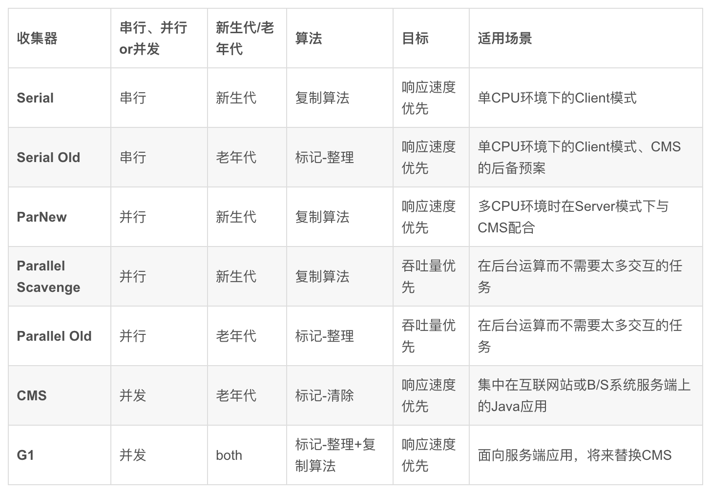

- [jvm](#jvm)
  - [问题](#问题)
    - [请谈谈对JVM内存模型的理解](#请谈谈对jvm内存模型的理解)
    - [堆内存和栈内存的区别](#堆内存和栈内存的区别)
    - [直接内存如何使用](#直接内存如何使用)
    - [哪些运行时内存是私有的，哪些是共有的](#哪些运行时内存是私有的哪些是共有的)
    - [类加载和对象实例化的区别](#类加载和对象实例化的区别)
    - [类加载器和什么是双亲委派模型？](#类加载器和什么是双亲委派模型)
    - [对象实例化时的内存分配策略及内容](#对象实例化时的内存分配策略及内容)
    - [对象实例化时是否有线程安全问题](#对象实例化时是否有线程安全问题)
    - [是否了解对象本身的内存布局](#是否了解对象本身的内存布局)
    - [对象有几种访问方式？各自的优缺点](#对象有几种访问方式各自的优缺点)
    - [一个对象到底占用多大内存空间](#一个对象到底占用多大内存空间)
    - [了解JVM工具么？(看你是否知道这些工具是干嘛的)](#了解jvm工具么看你是否知道这些工具是干嘛的)
    - [有调优经验么？(看你对这些工具的使用熟练度)](#有调优经验么看你对这些工具的使用熟练度)
    - [为什么要做垃圾回收？哪些内存区域执行垃圾回收？](#为什么要做垃圾回收哪些内存区域执行垃圾回收)
    - [怎么判断一片内存应该被执行垃圾回收？](#怎么判断一片内存应该被执行垃圾回收)
      - [GC Root](#gc-root)
      - [如何规避引用计数循环引用](#如何规避引用计数循环引用)
    - [谈谈垃圾回收算法](#谈谈垃圾回收算法)
    - [谈谈垃圾回收器](#谈谈垃圾回收器)
      - [CMS](#cms)
      - [G1](#g1)
  - [JVM内存模型篇](#jvm内存模型篇)
    - [直接内存](#直接内存)
    - [运行时数据区](#运行时数据区)
      - [方法区，元空间](#方法区元空间)
  - [JVM类加载](#jvm类加载)
    - [类加载过程](#类加载过程)
      - [加载](#加载)
      - [链接](#链接)
      - [初始化](#初始化)
    - [类加载机制](#类加载机制)
      - [双亲委派模型](#双亲委派模型)
      - [类加载机制被破坏的场景](#类加载机制被破坏的场景)
  - [JVM对象实例化](#jvm对象实例化)
    - [对象布局](#对象布局)
      - [对象头](#对象头)
  - [JVM工具及调优](#jvm工具及调优)
  - [JVM垃圾回收算法及垃圾回](#jvm垃圾回收算法及垃圾回)
## jvm
[jvm 基础问题](https://mp.weixin.qq.com/s/Hbo1RpQVACDzB1X8xWH9DA)
### 问题
#### 请谈谈对JVM内存模型的理解

#### 堆内存和栈内存的区别

#### 直接内存如何使用

#### 哪些运行时内存是私有的，哪些是共有的

#### 类加载和对象实例化的区别
```
类加载机制一共有五个步骤，分别是加载、链接、初始化、使用和卸载阶段.
链接阶段会细分成三个阶段，分别是验证、准备、解析阶段，这三个阶段的顺序是不确定的，这三个阶段通常交互进行。解析阶段通常会在初始化之后再开始，这是为了支持 Java 语言的运行时绑定特性（也被称为动态绑定）。
```
1. 加载
```
通过一个类的全限定名来获取定义此类的二进制字节流。
将这个字节流表示的一种存储结构转换为运行时数据区中方法区的数据结构。
在内存中生成一个 Class 对象，这个对象就代表了这个数据结构的访问入口。
```
2. 链接
```
验证阶段主要分为四个阶段的检验：
文件格式验证。
元数据验证。
字节码验证。
符号引用验证。

准备
准备阶段是为类中的变量分配内存并设置其初始值的阶段.这些变量所使用的内存都应当在方法区中进行分配，在 JDK 7 之前，HotSpot 使用永久代来实现方法区，是符合这种逻辑概念的。而在 JDK 8 之后，变量则会随着 Class 对象一起存放在 Java 堆中。

解析
解析阶段是 Java 虚拟机将常量池内的符号引用替换为直接引用的过程。将编译器指定的引用类的符号引用(唯一标识对象引用)替换为运行期间真正的内存指针地址
解析也分为四个步骤

类或接口的解析
字段解析
方法解析
接口方法解析

```
3. 初始化
```
初始化条件：
1. 在遇到 new、getstatic、putstatic 或者 invokestatic 这四条字节码指令时，如果没有进行过初始化，那么首先触发初始化。通过这四个字节码的名称可以判断，这四条字节码其实就两个场景，调用 new 关键字的时候进行初始化、读取或者设置一个静态字段的时候、调用静态方法的时候。
2. 在初始化类的时候，如果父类还没有初始化，那么就需要先对父类进行初始化。
3. 在使用 java.lang.reflect 包的方法进行反射调用的时候。
4. 当虚拟机启动时，用户需要指定执行主类的时候，说白了就是虚拟机会先初始化 main 方法这个类。
```
#### 类加载器和什么是双亲委派模型？

#### 对象实例化时的内存分配策略及内容

#### 对象实例化时是否有线程安全问题

#### 是否了解对象本身的内存布局

#### 对象有几种访问方式？各自的优缺点
```
1. 直接指针访问
对象创建时，局部变量表只保存对象的地址，地址指向的是堆中的实际对象的markword地址，JVM中采用的就是这种方式访问对象。
2. 句柄访问
通过句柄访问时局部变量保存的时句柄池的对象句柄，句柄池中，则会存储对象实例指针和对象类型指针。再通过这两个指针分别指向对象实例池中的对象和元数据的klass

相比直接指针访问，句柄访问方式由于需要2次访问，而直接指针只需要一次访问，因此句柄访问对象的速度相对较慢。但是对于垃圾回收器来说是比较友好的，因为对象移动无需更新栈中的局部变量表的内容，只需要更新句柄池中的对象实例指针的值。
```
#### 一个对象到底占用多大内存空间

#### 了解JVM工具么？(看你是否知道这些工具是干嘛的)

#### 有调优经验么？(看你对这些工具的使用熟练度)
[几种jvm调优场景](https://mp.weixin.qq.com/s/RBFsr691qj_M3LovuorQlg)
1. 介绍一下 JVM 中常用的调优、故障处理等工具
```
jps ：虚拟机进程工具，全称是 JVM Process Status Tool，它的功能和 Linux 中的 ps 类似，可以列出正在运行的虚拟机进程，并显示虚拟机执行主类 Main Class 所在的本地虚拟机唯一 ID，虽然功能比较单一，但是这个命令绝对是使用最高频的一个命令；
jstat：虚拟机统计信息工具，用于监视虚拟机各种运行状态的信息的命令行工具，它可以显示本地或者远程虚拟机进程中的类加载、内存、垃圾收集、即时编译等运行时数据；
jinfo：Java 工件信息工具，全称是 Workpieceuration Info for Java，它的作用是可以实时调整虚拟机各项参数；
jmap：Java 内存映像工具，全称是 Memory Map For Java，它用于生成转储快照，用来排查内存占用情况；
jhat：虚拟机堆转储快照分析工具，全称是 JVM Heap Analysis Tool，这个指令通常和 jmap 一起搭配使用，jhat 内置了一个 HTTP/Web 服务器，生成转储快照后可以在浏览器中查看。不过，一般还是 jmap 命令使用的频率比较高；
jstack：Java 堆栈跟踪工具，全称是 Stack Trace for Java 。顾名思义，这个命令用来追踪堆栈的使用情况，用于虚拟机当前时刻的线程快照，线程快照就是当前虚拟机内每一条正在执行的方法堆栈的集合。
```
2. 常见的 JVM 调优参数有哪些？
```
-Xms256m：初始化堆大小为 256m；
-Xmx2g：最大内存为 2g；
-Xmn50m：新生代的大小50m；
-XX:+PrintGCDetails 打印 gc 详细信息；
-XX:+HeapDumpOnOutOfMemoryError  在发生OutOfMemoryError错误时，来 dump 出堆快照；
-XX:NewRatio=4    设置年轻的和老年代的内存比例为 1:4；
-XX:SurvivorRatio=8 设置新生代 Eden 和 Survivor 比例为 8:2；
-XX:+UseSerialGC   新生代和老年代都用串行收集器 Serial + Serial Old
-XX:+UseParNewGC 指定使用 ParNew + Serial Old 垃圾回收器组合；
-XX:+UseParallelGC  新生代使用 Parallel Scavenge，老年代使用 Serial Old
-XX:+UseParallelOldGC：新生代 ParallelScavenge + 老年代 ParallelOld 组合；
-XX:+UseConcMarkSweepGC：新生代使用 ParNew，老年代使用 CMS；
-XX:NewSize：新生代最小值；
-XX:MaxNewSize：新生代最大值
-XX:MetaspaceSize 元空间初始化大小
-XX:MaxMetaspaceSize 元空间最大值
```
#### 为什么要做垃圾回收？哪些内存区域执行垃圾回收？

#### 怎么判断一片内存应该被执行垃圾回收？
```
引用计数，可达性分析
```
##### GC Root
```
1. Java 线程中，当前所有正在被调用的方法的引用类型参数、局部变量、临时值等。也就是与我们栈帧相关的各种引用
2. 类静态变量
3. 常量池
```
##### 如何规避引用计数循环引用
```
优点：实现简单，判定效率高；
缺点：无法解决对象相互循环引用的问题，对象A中引用了对象B，对象B中引用对象A。


```
#### 谈谈垃圾回收算法

```
介绍四种垃圾回收算法

垃圾回收算法与是否分代的关系
```
#### 谈谈垃圾回收器


```

常见垃圾回收器各自的特性，适用于哪个代？各自的优缺点

基础好的同学可以着重对比CMS和G1，最好有调优经验，这部分是加分点

谈谈GC对内存分配的影响(优先Eden、大对象及长期存活对象晋升以及空间担保分配)

基础好的同学可以谈谈近几年衍生出的新垃圾回收器，例如ZGC的特性，这块是加分点

基础好的同学可以跳出JVM的局限，谈谈其他语言的GC，并和JVM对比，这块是加分点
```
##### CMS
```
CMS（Concurrent Mark Sweep）收集器是一种以获取最短回收停顿时间为目标的收集器。采用的算法是“标记-清除”，运作过程分为四个步骤:

初始标记:标记GC Roots 能够直接关联到达对象
并发标记:进行GC Roots Tracing 的过程
重新标记:修正并发标记期间因用户程序继续运作而导致标记产生变动的那一部分标记记录
并发清除:用标记清除算法清除对象。
其中初始标记和重新标记这两个步骤仍然需要"stop the world"。耗时最长的并发标记与并发清除过程收集器线程都可以与用户线程一起工作，总体上来说CMS收集器的内存回收过程是与用户线程一起并发执行的。

优点：并发收集，低停顿

缺点：
1. CMS收集器对CPU资源非常敏感，CMS默认启动对回收线程数(CPU数量+3)/4，当CPU数量在4个以上时，并发回收时垃圾收集线程不少于25%，并随着CPU数量的增加而下降，但当CPU数量不足4个时，对用户影响较大。

2. CMS无法处理浮动垃圾，可能会出现“Concurrent Mode Failure”失败而导致一次FullGC的产生。这时会地洞后备预案，临时用SerialOld来重新进行老年代的垃圾收集。由于CMS并发清理阶段用户线程还在运行，伴随程序运行自然还会有新的垃圾产生，这部分垃圾出现在标记过程之后，CMS无法在当次处理掉，只能等到下一次GC，这部分垃圾就是浮动垃圾。同时也由于在垃圾收集阶段用户线程还需要运行，那也就需要预留足够的内存空间给用户线程使用，因此CMS收集器不能像其他老年代几乎完全填满再进行收集。可以通过参数-XX:CMSInitiatingOccupancyFraction修改CMS触发的百分比。

3. CMS采用的是标记清除算法，因此垃圾回收后会产生空间碎片。通过参数可以进行优化。
```
```
-XX:UseConMarkSweepGC
-XX:UserCMSCompactAtFullCollection #开启碎片整理（默认是开的）
 
-XX:CMSFullGCsBeforeCompaction #执行多少次不压缩的Full GC之后，跟着来一次压缩的Full GC
```
##### G1
```
G1收集器是一款面向服务端应用的垃圾收集器，目前是JDK9的默认垃圾收集器,使用于新生代和老年代垃圾收集器
G1 是基于 Region 来进行回收的，Region 就是堆内存中任意的布局，每一块 Region 都可以根据需要扮演 Eden 空间、Survivor 空间或者老年代空间，
收集器能够对不同的 Region 角色采用不同的策略来进行处理。Region 中还有一块特殊的区域，这块区域就是 Humongous 区域，它是专门用来存储大对象的，
G1 认为只要大小超过了Region 容量一半的对象即可判定为大对象。如果超过了 Region 容量的大对象，将会存储在连续的 Humongous Region 中，G1 大多数
行为都会把 Humongous Region 作为老年代来看待。

垃圾收集过程：
初始标记：这个步骤也仅仅是标记一下 GC Roots 能够直接关联到的对象；并修改 TAMS 指针的值（每一个 Region 都有两个 RAMS 指针），使得下一阶段
用户并发运行时，能够在可用的 Region 中分配对象，这个阶段需要暂停用户线程，但是时间很短。这个停顿是借用 Minor GC 的时候完成的，所以可以忽略不计。
并发标记：从 GC Root 开始对堆中对象进行可达性分析，递归扫描整个堆中的对象图，找出要回收的对象。当对象图扫描完成后，重新处理 SATB 记录下的在并发时有引用的对象；
最终标记：对用户线程做一个短暂的暂停，用于处理并发阶段结束后遗留下来的少量 SATB 记录（一种原始快照，用来记录并发标记中某些对象）
筛选回收：负责更新 Region 的统计数据，对各个 Region 的回收价值和成本进行排序，根据用户所期望的停顿时间来制定回收计划，可以自由选择多个Region
构成回收集，然后把决定要回收的那一部分 Region 存活对象复制到空的 Region 中，再清理掉整个旧 Region 的全部空间。这里的操作设计对象的移动，
所以必须要暂停用户线程，由多条收集器线程并行收集。
适用场景：要求尽可能可控 GC 停顿时间；内存占用较大的应用。可以用 -XX:+UseG1GC 使用 G1 收集器，jdk9 默认使用 G1 收集器

```
```
-XX:+UseG1GC 
-XX:MaxGCPauseMillis	GC的最大停顿时间，仅在使用Parallel Scavenge收集器时生效
```

### JVM内存模型篇
#### 直接内存
#### 运行时数据区
##### [方法区，元空间](https://zhuanlan.zhihu.com/p/344537168)
```
在jdk7及以前，习惯上把方法区，称为永久代。jdk8开始，使用元空间取代了永久代。
JDK 1.8后，元空间存放在堆外内存中。
JDK1.6及以前有永久代，静态变量存储在永久代上
JDK1.7有永久代，但已经逐步 “去永久代”，字符串常量池，静态变量移除，保存在堆中
JDK1.8无永久代，类型信息，字段，方法，常量保存在本地内存的元空间，但字符串常量池、静态变量仍然在堆中。


加载的类信息，方法区确定了能加载的类的数量
类变量，static，常量
字符串常量池

```
### JVM类加载
#### 类加载过程
##### 加载
##### 链接
##### 初始化
#### 类加载机制

##### 双亲委派模型
双亲委派模型的式作过程是：如果一个类加载器收到了类加载的请求，它首先不会自己去尝试加载这个类，而是把这个请求委派给父类加载器去完成，每一个层次的类加载器都是如此，因此所有的加载请求最终都应该传送到顶层的启动类加载器中，只有当父加载器反馈自己无法完全这个加载请求（它的搜索范围中没有找到所需的类）时，子加载器才会尝试自己去加载。
##### 类加载机制被破坏的场景
```
JAVA 自定义的SPI,比如JNDI中的数据库驱动需要调用对应厂商的实现，这时需要打破机制
```
### JVM对象实例化
#### 对象布局
[对象布局](https://www.cnblogs.com/Jack-Blog/p/14481982.html#%E5%AF%B9%E8%B1%A1%E7%B1%BB%E4%BA%8C%E5%88%86%E6%A8%A1%E5%9E%8B)

##### 对象头
```
对象头 = Mark Word + 类型指针。如果对象为数组，除了普通对象的两部分外对象头还包含数组长度。
Mark Word保存了对象运行时必要的信息，包括哈希码（HashCode）、GC分代年龄、偏向状态、锁状态标志、偏向线程ID、偏向时间戳等信息。通过类型指针，可以找到对象对应的类型信息。32位虚拟机和64位虚拟机的Mark Word长度分别为4字节和8字节。


```
### JVM工具及调优

### JVM垃圾回收算法及垃圾回