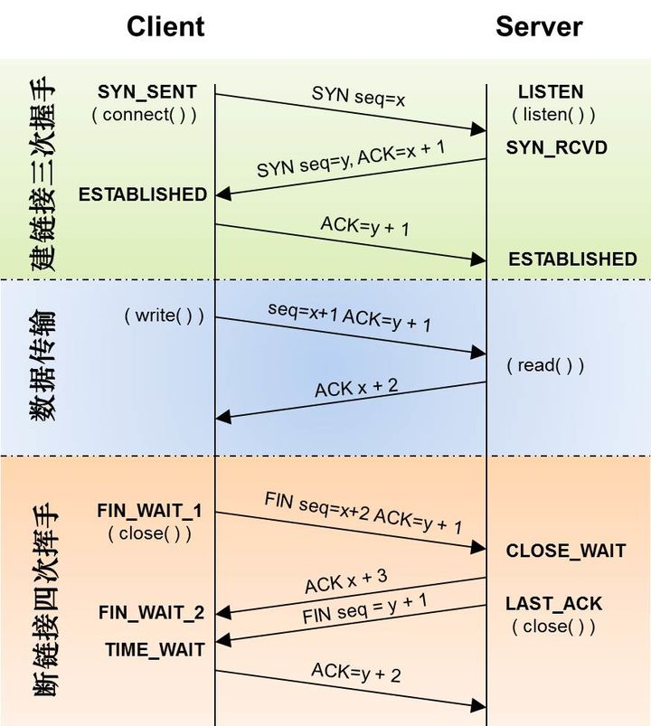

- [network](#network)
  - [OSI模型和TCP/IP](#osi模型和tcpip)
  - [DDOS 攻击](#ddos-攻击)
    - [SYN Flood](#syn-flood)
    - [UDP Flood](#udp-flood)
  - [select、poll和epoll区别](#selectpoll和epoll区别)
    - [select](#select)
    - [poll](#poll)
    - [epoll](#epoll)
  - [数据传输大端和小端](#数据传输大端和小端)
  - [五种IO模式](#五种io模式)
  - [什么是进程和线程](#什么是进程和线程)
  - [linux 虚拟内存和内存映射](#linux-虚拟内存和内存映射)
  - [sendfile 和mmap 的io分析](#sendfile-和mmap-的io分析)
- [TCP](#tcp)
  - [请简述TCP\UDP的区别](#请简述tcpudp的区别)
  - [tcp 三次握手和四次挥手](#tcp-三次握手和四次挥手)
  - [TCP的可靠性怎么保证？](#tcp的可靠性怎么保证)
  - [TCP 第四次挥手为什么要等待2SML?](#tcp-第四次挥手为什么要等待2sml)
- [HTTP](#http)
  - [在浏览器中输入网址之后执行会发生什么？](#在浏览器中输入网址之后执行会发生什么)
  - [HTTP 1.0，1.1，2.0 的版本区别](#http-101120-的版本区别)
  - [讲一下HTTP与HTTPS 的区别。](#讲一下http与https-的区别)
  - [常用 HTTP 状态码](#常用-http-状态码)
## network
### OSI模型和TCP/IP

| | | |
| ---- | ---- | ---- | 
|OSI七层网络模型|	TCP/IP四层概念模型|	对应网络协议|
|应用层(Application)|	应用层|	HTTP、TFTP、FTP、NFS、SMTP|
|表示层(Presentation)| |	Telnet、Rlogin、SNMP、Gopher|
|会话层(Session)| |	SMTP、DNS|
|传输层(Transport)|	传输层|	TCP、UDP|
|网络层(Network)|	网络层|	IP、ICMP、ARP、RARP、AKP、UUCP|
|数据链路层(Data Link)|	数据链路层|	FDDI、Ethernet、Arpanet、PDN|
|物理层(Physical)| |	IEEE802.1A IEEE802.2到IEEE802.11|
OSI七层和TCP/IP的区别

TCP/IP他是一个协议簇；而OSI（开放系统互联）则是一个模型，且TCP/IP的开发时间在OSI之前。
TCP/IP是由一些交互性的模块做成的分层次的协议，其中每个模块提供特定的功能；OSi则指定了哪个功能是属于哪一层的。
TCP/IP是五层(TCP/IP模型中把一两层独立开)结构，而OSI是七层结构。OSI的最高三层在TCP中用应用层表示。
### DDOS 攻击
#### SYN Flood
它利用了TCP协议的三次握手机制，攻击者通常利用工具或者控制僵尸主机向服务器发送海量的变源IP地址或变源端口的TCP SYN报文，工具并不会响应来自服务器SYN-ACK报文,服务器响应了这些报文后就会生成大量的半连接，当系统资源被耗尽后，服务器将无法提供正常的服务
1. 如何识别和防御SYN Flood？
```
1. 简单模式，人工添加ip过滤，但是无法防止虚拟的ip攻击

2. Anti-DDoS系统处理SYN报文主要有两种手段，源认证和首包丢弃
源认证： anti-DDoS 系统在数据路由前做sync-ack, 如果对方回复，则将消息转发到后端，如果不回复，则添加到黑名单。该方法只是将DDoS攻击放到了anti 系统，仍然存在网络压力；无法解决变源的黑客攻击。
TCP 的可靠性除了应答机制，还有重传机制。而黑客攻击往往是以变动的源信息进行连接，不实现重传，使用首包丢弃可以很好的过滤这些SYN数据包，达到不需要握手即可防止攻击

```
#### UDP Flood
传统UDP Flood攻击是一种消耗攻击和被攻击双方资源的带宽类攻击方式。攻击者通过僵尸网络向目标设备发送大量伪造的UDP报文，这种报文一般为大包且速率非常快，通常会造成链路拥塞甚至网络瘫痪的危害
1. UDP反射放大攻击
```
在UDP协议中，正常情况下，客户端发送请求包到服务器，服务器返回响应包给客户端，一次交互就已完成，中间没有校验过程。反射攻击正是利用了UDP协议面向无连接、缺少源认证机制的特点，将请求包的源IP地址篡改为攻击目标的IP地址，最终服务器返回的响应包就会被送到攻击目标，形成反射攻击。

防范： 基础防范为根据源ip进行防范，或者限制udp流量；后续根据攻击报文具有相同的特征，可以执行报文特征进行过滤。
```
### select、poll和epoll区别
[多路复用](https://juejin.cn/post/6931543528971436046)
IO多路复用是一种同步IO,是指使用一个线程来检查多个文件描述符（Socket）的就绪状态，比如调用select和poll函数，传入多个文件描述符，如果有一个文件描述符就绪，则返回，否则阻塞直到超时。得到就绪状态后进行真正的操作可以在同一个线程里执行，也可以启动线程执行（比如使用线程池）

#### select
```
select本质上是通过设置或检查存放fd标志位的数据结构(句柄数组)进行下一步处理.
流程：
1. 用户线程调用select，将fd_set从用户空间拷贝到内核空间
2. 内核在内核空间对fd_set遍历一遍，检查是否有就绪的socket描述符，如果没有的话，就会进入休眠，直到有就绪的socket描述符
3. 内核返回select的结果给用户线程，即就绪的文件描述符数量
4. 用户拿到就绪文件描述符数量后，再次对fd_set进行遍历，找出就绪的文件描述符
5. 用户线程对就绪的文件描述符进行读写操作

缺点：
每次调用select，都需要将fd_set从用户空间拷贝到内核空间，当fd很多时，这个开销很大
最大连接数（支持的最大文件描述符数量）有限制，一般为1024
每次有活跃的socket描述符时，都需要遍历一次fd_set，造成大量的时间开销，时间复杂度是O(n)
将fd_set从用户空间拷贝到内核空间，内核空间也需要对fd_set遍历一遍
```
#### poll
```
执行过程（基本与select类型）

用户线程调用poll系统调用，并将文件描述符链表拷贝到内核空间
内核对文件描述符遍历一遍，如果没有就绪的描述符，则内核开始休眠，直到有就绪的文件描述符
返回给用户线程就绪的文件描述符数量
用户线程再遍历一次文件描述符链表，找出就绪的文件描述符
用户线程对就绪的文件描述符进行读写操作

相比select:
select存储的数据结构是文件描述符数组，poll采用链表
select有最大连接数限制，poll没有最大限制，因为poll采用链表存储

缺点：
内核线程都需要遍历文件描述符，并且当内核返回就绪的文件描述符数量后，还需要遍历一次找出就绪的文件描述符
需要将文件描述符数组或链表从用户空间拷贝到内核空间
性能开销会随文件描述符的数量而线性增大
```
#### epoll
```
红黑树存储监控的文件描述符，双链表存储就绪的文件描述符,当有就绪事件时，系统注册的回调函数就会被调用，
将就绪的fd放入到就绪链表中。使用内存映射(mmap)，不需要从用户空间频繁拷贝fd数据到内核空间.

通过内核管理文件句柄，当句柄存在就绪事件时，将句柄放到就绪队列，
当用户侧调用epoll wait时，检测就绪队列，如果不存在，阻塞，存在直接返回就绪队列，这里就绪队列使用了内存映射，将内核态内存和用户内存映射到同一个虚拟内存
这样减少了数据的拷贝，用户侧可以直接处理就绪句柄事件
```
1. epoll 的水平触发（LT）和边缘触发（ET）的区别
```

LT模式：只要文件描述符还有数据可读，每次epoll_wait就会返回它的事件（只要有数据就触发）

ET模式：只有数据流到来的时候才触发，不管缓冲区是否还有数据（只有数据流到来才会触发）
```
### 数据传输大端和小端
```
大端：高位在前，方便读取，网络字节序一般是指大端（Big-Endian，对大部分网络传输协议而言）传输
小端：高位在后
```
### 五种IO模式
[5种IO模型](https://blog.csdn.net/hustzw07/article/details/108327644)
```
同步: 系统内核准备好数据后，需要进程同步复制数据到用户内存
阻塞：系统调用时，如果数据没有准备好，是否阻塞等待

同步阻塞：系统调用后，一直阻塞到数据复制到进程内存中
同步非阻塞： 系统调用后，如果数据没有准备好，直接返回，可以循环调用是否准备就绪，准备完成，则复制数据到进程内存
多路复用：多个网络通道服用一个线程进行监听数据是否就绪，就绪后分发处理
信号驱动：系统调用时，通过注册信号到os，os准备好数据后，信号通知程序进行同步复制数据处理
异步：系统调用后，系统准备数据并将数据复制到进程内存后通知进程处理数据
```
### 什么是进程和线程
```

```
### linux 虚拟内存和内存映射
[虚拟内存和内存映射](https://zhuanlan.zhihu.com/p/116896185)
[mmap](https://zhuanlan.zhihu.com/p/73453720)
```
物理内存是一个巨大的数组，且内存有限。
虚拟内存可以看作是操作系统维护的程序的应用内存的缓存。其机制为通过虚拟内存给程序分配内存，让程序
认为自己的内存是无限且连续的，操作系统维护虚拟内存对应的物理内存和磁盘的映射页表。
当程序访问虚拟内存时，首先操作系统通过页表查看是否缓存内存，缓存直接操作内存。否则发生缺页中断，操作系统
先将磁盘数据读取到内存中，然后恢复进程继续执行中断时的指令

```
### sendfile 和mmap 的io分析
```

```
## TCP
### 请简述TCP\UDP的区别
```
TCP面向连接，UDP面向非连接即发送数据前不需要建立链接
TCP提供可靠的服务（数据传输），UDP无法保证
TCP面向字节流，会出现拆包粘包现象，UDP面向报文，其报头具有报文长度字段，不会存在拆包，粘包现象。
TCP需要建立连接，数据传输慢，UDP数据传输快,
```
### tcp 三次握手和四次挥手

```

```

### TCP的可靠性怎么保证？
[可靠性](https://cloud.tencent.com/developer/article/1591990)
```
1.校验和，校验和需一致才能传输成功。

2.确认应答和序列号。TCP传输的过程中，每次接收到数据后需要对传输方进行确认应答。TCP对传输过程中的每个数据都进行了编号，确保了传输的可靠性。

3.超时重传：当报文发出后在一定的时间内未收到接收方的确认，发送方就会进行重传

4.连接管理：通过三次握手和四次挥手来确保连接的可靠性。

5.流量控制：TCP支持根据接收端的处理能力，来决定发送端的发送速度
TCP 利用滑动窗口实现流量控制的机制， 而滑动窗口大小是通过TCP首部的窗口大小字段来通知对方

6.拥塞控制：TCP引入慢启动机制，先发出少量数据，就像探路一样，先摸清当前的网络拥堵状态后，再决定按照多大的速度传送数据。
慢启动算法下的cwnd大小是指数增长，所以不能任 cwnd 任意增长，所以我们引入一个慢启动门限（ssthresh）的阈值来控制 cwnd 的增长。

ssthresh的作用是：

当cwnd < ssthresh时，使用慢开始算法,从1开始指数增大。
当cwnd > ssthresh时，改用拥塞避免算法，每次增加1个字节，直到约定的滑动窗口大小。
```
### TCP 第四次挥手为什么要等待2SML?
```
考虑丢包的问题，如果第四次挥手的报文丢失，服务端没收到确认 ack 报文就会重发第三次挥手的报文，这样报文一去一回最长时间就是 2MSL，所以需要等这么长时间来确认服务端确实已经收到了。

```
## HTTP
### 在浏览器中输入网址之后执行会发生什么？
```
查找域名对应的IP地址。这一步会依次查找浏览器缓存，系统缓存，路由器缓存，ISPNDS缓存，根域名服务器
然后建立tcp连接，ssl认证和密钥分发
浏览器向IP对应的web服务器发送一个HTTP请求
服务器响应请求，发回网页内容
浏览器解析网页内容
```
### HTTP 1.0，1.1，2.0 的版本区别
```
HTTP 1.0
HTTP 1.0规定浏览器与服务器只保持短暂的连接，浏览器的每次请求都需要与服务器建立一个TCP连接，服务器完成请求处理后立即断开TCP连接。它也可以强制开启长链接，例如设置Connection: keep-alive 这个字段

HTTP 1.1
引入了长连接，即TCP连接默认不关闭，可以被多个请求复用。
引入了管道机制（pipelining），即在同一个TCP连接里面，客户端可以同时发送多个请求。
缓存处理，引入了更多的缓存控制策略，如Cache-Control、Etag/If-None-Match等。
错误状态管理，新增了24个错误状态响应码，如409表示请求的资源与资源的当前状态发生冲突。

HTTP 2
采用了多路复用，即在一个连接里，客户端和浏览器都可以同时发送多个请求或回应，而且不用按照顺序一一对应。
服务端推送，HTTP 2允许服务器未经请求，主动向客户端发送资源
```
### 讲一下HTTP与HTTPS 的区别。
```
HTTP，超文本传输协议，英文是Hyper Text Transfer Protocol，是一个基于TCP/IP通信协议来传递数据的协议。HTTP存在这几个问题：
请求信息明文传输，容易被窃听截取。
数据的完整性未校验，容易被篡改
没有验证对方身份，存在冒充危险

HTTPS就是为了解决HTTP存在问题的。HTTPS，英文是HyperText Transfer Protocol over Secure Socket Layer，可以这么理解Https是身披SSL(Secure Socket Layer)的HTTP，即HTTPS 协议 = HTTP+SSL/TLS。通过 SSL证书来验证服务器的身份，并为浏览器和服务器之间的传输数据进行加密。

它们主要区别：
数据是否加密: Http 是明文传输，HTTPS是密文
默认端口: Http默认端口是80，Https默认端口是443
资源消耗：和HTTP通信相比，Https通信会消耗更多的CPU和内存资源，因为需要加解密处理；
安全性: http不安全，https比较安全。
身份认证： https 支持双向认证，http无状态
```
### 常用 HTTP 状态码
1. 1XX
```
Informational（信息性状态码） 接受的请求正在处理
```
2. 2XX
```
2XX	Success（成功状态码） 请求正常处理完毕
200	OK，表示从客户端发来的请求在服务器端被正确处理
204	No content，表示请求成功，但响应报文不含实体的主体部分
206	Partial Content，进行范围请求成功
```
3. 3XX
```
3XX	Redirection（重定向状态码） 需要进行附加操作以完成请求
301	moved permanently，永久性重定向，表示资源已被分配了新的 URL
302	found，临时性重定向，表示资源临时被分配了新的 URL
303	see other，表示资源存在着另一个 URL，应使用 GET 方法获取资源（对于301/302/303响应，几乎所有浏览器都会删除报文主体并自动用GET重新请求）
304	not modified，表示服务器允许访问资源，但请求未满足条件的情况（与重定向无关）
307	temporary redirect，临时重定向，和302含义类似，但是期望客户端保持请求方法不变向新的地址发出请求
```
4. 4XX
```
4XX	Client Error（客户端错误状态码） 服务器无法处理请求
400	bad request，请求报文存在语法错误
401	unauthorized，表示发送的请求需要有通过 HTTP 认证的认证信息
403	forbidden，表示对请求资源的访问被服务器拒绝，可在实体主体部分返回原因描述
404	not found，表示在服务器上没有找到请求的资源
```
5. 5XX
```
5XX	Server Error（服务器错误状态码） 服务器处理请求出错
500	internal sever error，表示服务器端在执行请求时发生了错误
501	Not Implemented，表示服务器不支持当前请求所需要的某个功能
503	service unavailable，表明服务器暂时处于超负载或正在停机维护，无法处理请求
```