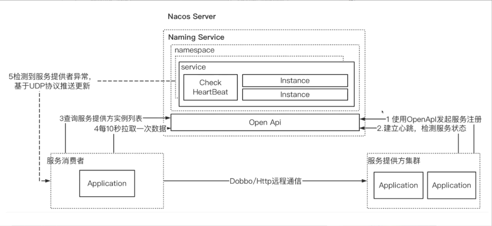

- [cloud alibaba](#cloud-alibaba)
  - [sentinel(熔断限流)](#sentinel熔断限流)
    - [谈谈服务降级、熔断、服务隔离](#谈谈服务降级熔断服务隔离)
  - [openfeign(http组件)](#openfeignhttp组件)
  - [loadbanlancer(负载均衡组件)](#loadbanlancer负载均衡组件)
  - [gateway(网关路由)](#gateway网关路由)
  - [nacos(注册中心，工件中心)](#nacos注册中心工件中心)
    - [naming](#naming)
      - [服务注册](#服务注册)
      - [服务发现](#服务发现)
      - [服务健康检测](#服务健康检测)
      - [服务动态感知](#服务动态感知)
    - [Workpiece](#Workpiece)
    - [nacos 如何支持AP和CP?](#nacos-如何支持ap和cp)

## cloud alibaba
### sentinel(熔断限流)
#### 谈谈服务降级、熔断、服务隔离
```
服务降级：当客户端请求服务器端的时候，防止客户端一直等待，不会处理业务逻辑代码，直接返回一个友好的提示给客户端。
服务熔断是在服务降级的基础上更直接的一种保护方式，当在一个统计时间范围内的请求失败数量达到设定值（requestVolumeThreshold）或当前的请求错误率达到设定的错误率阈值（errorThresholdPercentage）时开启断路，之后的请求直接走fallback方法，在设定时间（sleepWindowInMilliseconds）后尝试恢复。
服务隔离就是Hystrix为隔离的服务开启一个独立的线程池，这样在高并发的情况下不会影响其他服务。服务隔离有线程池和信号量两种实现方式，一般使用线程池方式。
```
### openfeign(http组件)
### loadbanlancer(负载均衡组件)
### gateway(网关路由)
### nacos(注册中心，工件中心)

OpenAPI：功能访问入口。
Workpiece Service、Naming Service：Nacos提供的工件服务、名字服务模块。
Consistency Protocol：一致性协议，用来实现Nacos集群节点的数据同步，使用Raft算法实现。

#### naming
##### 服务注册
利用OpenAPI 注册实例到nacos server,可以注册meta信息用于服务发现时策略处理
```
NacosServiceRegistry：完成服务注册，实现ServiceRegistry。

NacosRegistration：用来注册时存储nacos服务端的相关信息。

NacosAutoServiceRegistration 继承spring中的AbstractAutoServiceRegistration，AbstractAutoServiceRegistration实现ApplicationListener<WebServerInitializedEvent>，通过事件监听来发起服务注册，到时候会调用NacosServiceRegistry.register(registration)

```
##### 服务发现
服务发现由NacosWatch完成，它实现了Spring的Lifecycle接口，容器启动和销毁时会调用对应的start()和stop()方法。

NacosWatch 会定时的触发事件进行服务发现更新服务实例列表，定时30秒
##### 服务健康检测

临时节点：client 注册时会开启心跳检测，不停的向nacos server发起心跳检测，告知自己的健康状态，每5秒钟一次；
持节节点： server端会定期调用健康检测接口进行探测
nacos server发现该服务心跳检测时间超时会发布超时事件来告知服务消费者更新实例(UDP)
```
BeatReactor : 心跳上报主件，通过addBeatInfo(String serviceName, BeatInfo beatInfo) 对服务进行健康信息上报
```
##### 服务动态感知
1. 定时轮询拉取
```
服务消费者订阅后会执行一个轮询任务（每6s执行一次）用来拉取最新的服务提供者信息并实时更新,实现在ServiceInfoUpdateService中的UpdateTask类。
```
2. 服务端动态通知
```
当心跳检测超时也就是未及时收到服务提供者的心跳包，nacos server判定该服务状态异常(或者提供者主动注册和注销实例)，随后通过UDP推送服务信息用来告知对应服务消费者，服务消费者通过PushReceiver来处理udp协议
```
#### Workpiece
#### nacos 如何支持AP和CP?
[ap,cp](https://www.jianshu.com/p/9a8f74357b85)