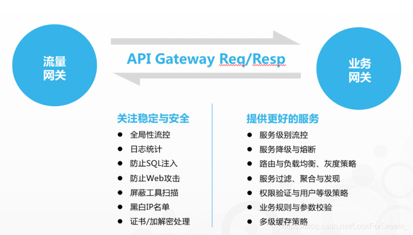

### spring cloud gateway
1. 网关的角色是作为一个 API 架构，用来保护、增强和控制对于 API 服务的访问。用来管理授权、访问控制和流量限制等.
2. 

#### HandlerMapping

RoutePredicateHandlerMapping
PredicateFactory

##### RoutePredicateHandlerMapping
1. 属性
```
	private final FilteringWebHandler webHandler;
	private final RouteLocator routeLocator; //
	private final Integer managementPort;
	private final ManagementPortType managementPortType;
```
2. 功能
```
通过RouteLocator 进行Predicte，如果不匹配直接返回错误
如果匹配对应的路由，则返回webHandler，并设置Route到exchange的gatewayRoute属性
提示在Predicte过程中有对cors进行处理
```
#### WebHandler
#####  FilteringWebHandler
1. 属性
```
	private final List<GatewayFilter> globalFilters; //适配后的GlobalFilters
```
2. 功能
``` 
```
#### filter
##### DefaultGatewayFilterChain
1. 
##### AbstractGatewayFilterFactory
##### SpringCloudCircuitBreakerFilterFactory
1. 属性
2. 功能
``` 
gateway 请求熔断处理
```

#### predicate
##### DefaultAsyncPredicate 
1. 通过代理Predicate实现异步的断言
##### DefaultServerWebExchange
1. 
##### RouteLocator
1. 一个顶级获取Route的接口：Flux<Route> getRoutes();
##### CachingRouteLocator 
1. 属性
```

	private static final String CACHE_KEY = "routes";  // 缓存key
	private final RouteLocator delegate;  // CompositeRouteLocator：可以自定义和配置文件多种
	private final Flux<Route> routes;  // Route表
    // 缓存的Route : CACHE_KEY->routes
	private final Map<String, List> cache = new ConcurrentHashMap<>();
	private ApplicationEventPublisher applicationEventPublisher;

```
2. 功能
```
implement ApplicationListener<RefreshRoutesEvent>: 
当接收到事件会刷新Route缓存，

通过getRoutes() 接口返回Flux<Route>
```
##### RouteDefinitionRouteLocator
1. 属性
```
    // 用于加载Route的加载器：InMemoryRouteDefinitionRepository，PropertiesRouteDefinitionLocator
	private final RouteDefinitionLocator routeDefinitionLocator; 

	private final ConfigurationService configurationService;

	private final Map<String, RoutePredicateFactory> predicates = new LinkedHashMap<>();

	private final Map<String, GatewayFilterFactory> gatewayFilterFactories = new HashMap<>();

	private final GatewayProperties gatewayProperties;
```
##### Route
1. 属性
``` java
	private final String id;  // 标识符
	private final URI uri; // 转发uri
	private final int order; // 多个Route排序标识， implement Ordered
	private final AsyncPredicate<ServerWebExchange> predicate; 断言
	private final List<GatewayFilter> gatewayFilters;  // 过滤器
	private final Map<String, Object> metadata;  // 当前Route 元数据，全程可获取使用
```
#### configuration
##### GatewayAutoConfiguration
#### RouteRefreshListener
1. 功能
``` 
implements ApplicationListener<ApplicationEvent>:
当HeartbeatEvent 发生时，会发送RefreshRoutesEvent 更新路由

NacosWatch： 定时30s 发送一个心跳事件
```